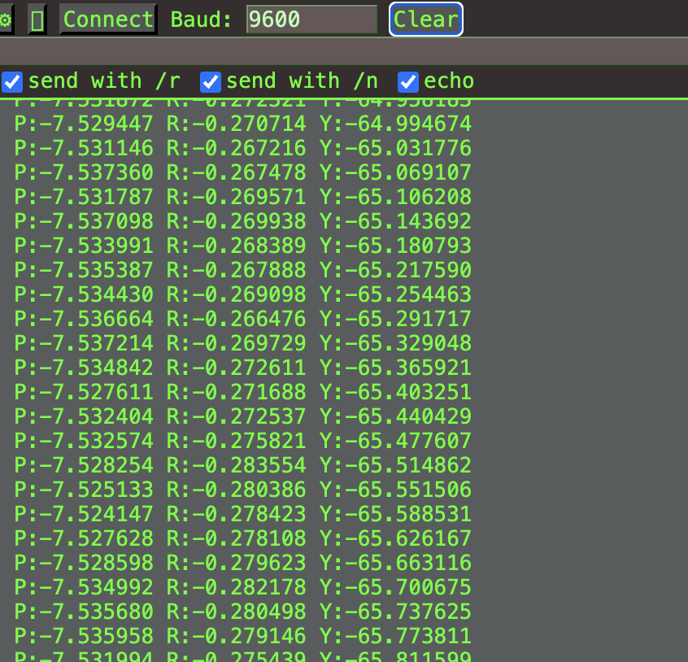
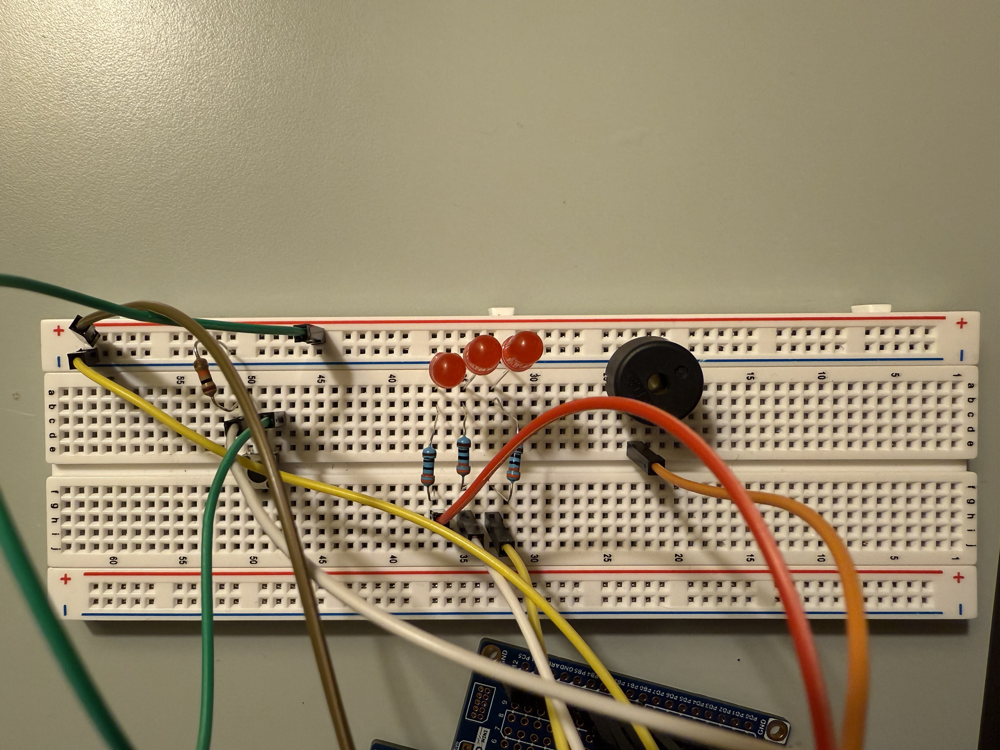
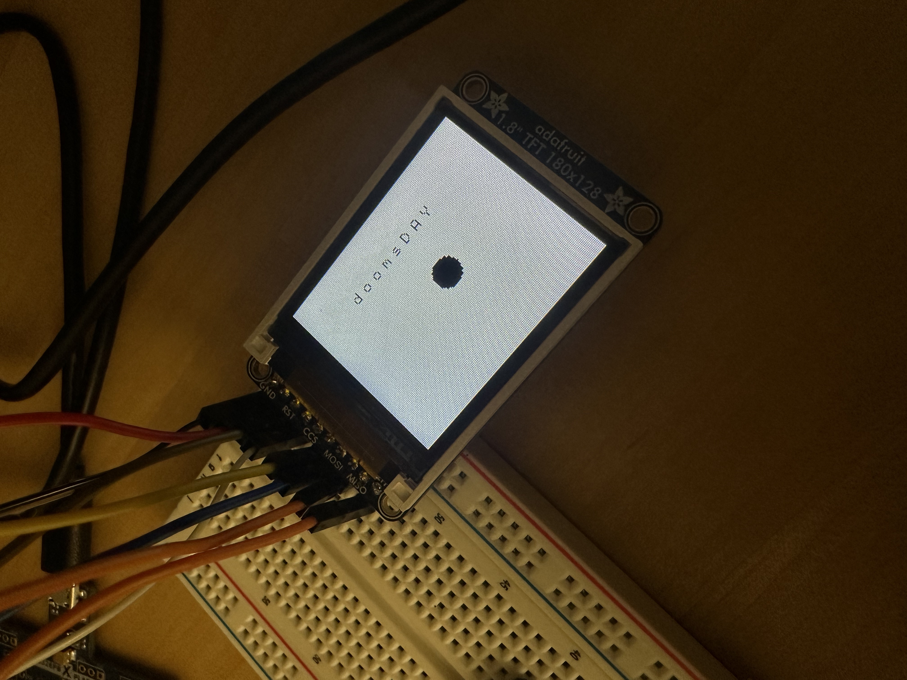
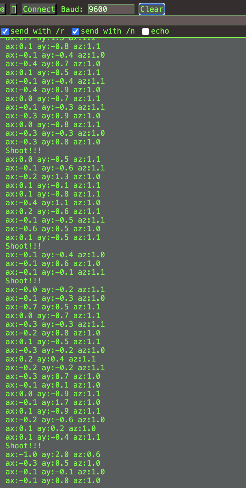
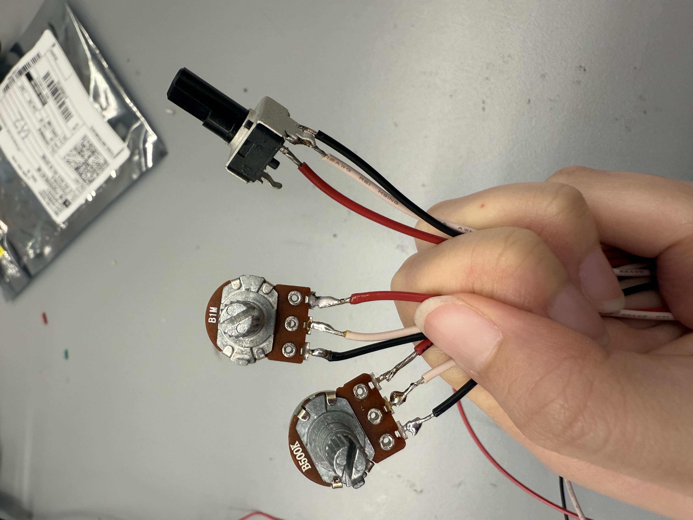
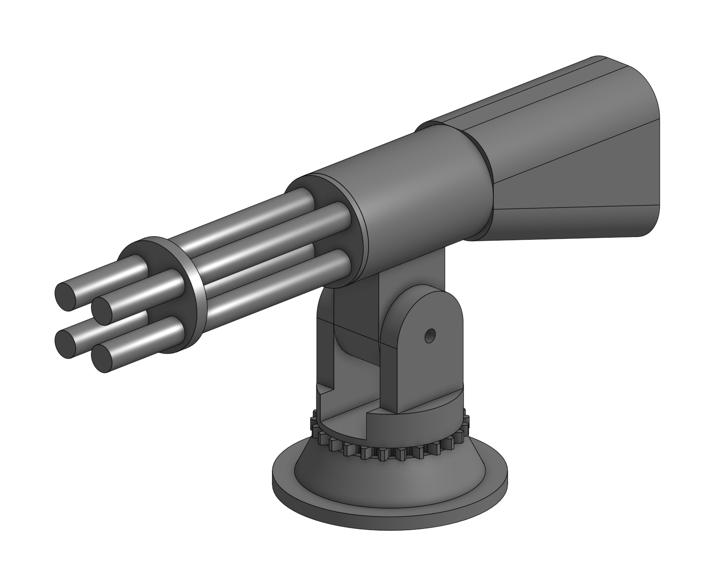
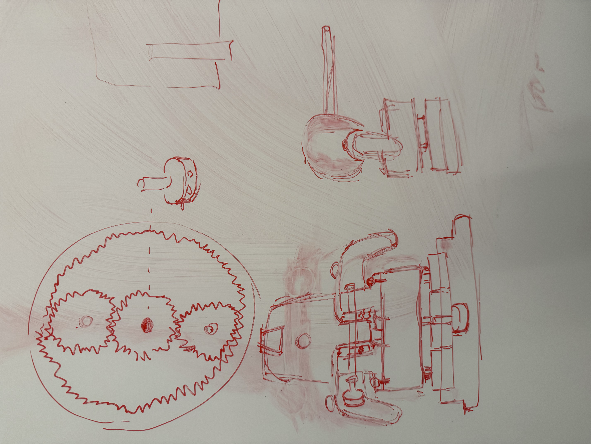
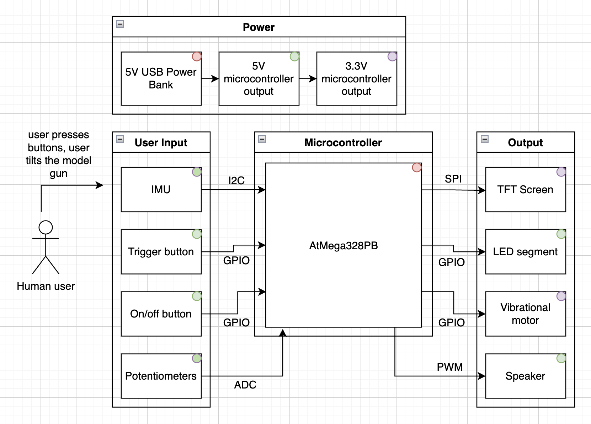
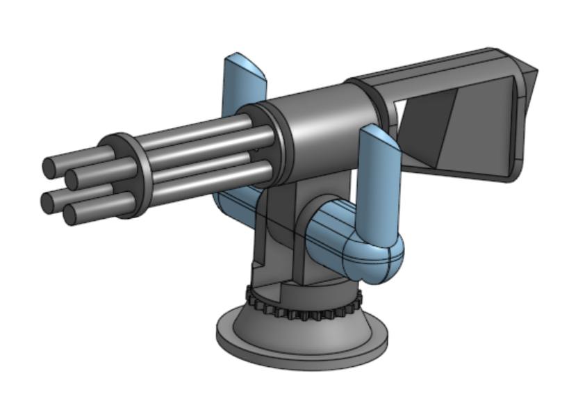
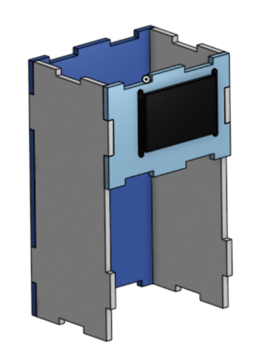

# Final Project

**Team Number:** T14

**Team Name:** doomsDAY

| Team Member Name | Email Address           |
| ---------------- | ----------------------- |
| Amaris Chen      | amarisch@seas.upenn.edu |
| Daniel Lin       | danilin@seas.upenn.edu  |
| Yi Lu Zheng      | yzheng6@seas.upenn.edu  |

**GitHub Repository URL:** [https://github.com/upenn-embedded/final-project-s26-t14.git](https://github.com/upenn-embedded/final-project-s26-t14.git)

**GitHub Pages Website URL:** [https://upenn-embedded.github.io/final-project-s26-t14/](https://upenn-embedded.github.io/final-project-s26-t14/)

## Final Project Proposal

### 1. Abstract

The Mini Arcade Station features a simplified smash-TV shooting game with an external model turret gun in place of joy sticks. It has a TFT screen to display menu and game, signal lights, a buzzer/speaker to generate sound output, and an IMU sensor to determine turret angle.

### 2. Motivation

For retro arcade lovers and parents on a tight budget, the Mini Arcade Station is perfect to have while occupying a small space. This project not only allows gamer folks to play an arcade-style game within the homes, but it also takes a child's attention away from the phone and onto a physical game that is tactile and interactive. The shooting game itself is inspired from Stardew Valley's Journey of the Prairie King, a minigame which Amaris enjoys.

### 3. System Block Diagram

### 4. Design Sketches

### 5. Software Requirements Specification (SRS)

**5.1 Definitions, Abbreviations**

GPIO: General Purpose Input Output

LED: Light Emitting Diode

I2C: Inter-Integrated Circuit

SPI: Serial Peripheral Interface

TFT LCD: Thin-Film Transistor Liquid Crystal Display

**5.2 Functionality**

| ID     | Description                                                                                                                                     |
| ------ | ----------------------------------------------------------------------------------------------------------------------------------------------- |
| SRS-01 | The IMU 3-axis acceleration will be used to measure the position of the gun and where the cursor should be on screen relative to gun position. |
| SRS-02 | Use interrupts to handle button presses and game states (such as reloading, shooting, killing enemies, etc.)                                    |
| SRS-03 | I2C communication will be used to communication data between the gun and the main arcade machine.                                               |
| SRS-04 | The health of the player should be displayed through the LED indicators at the top of the arcade machine.                                       |
| SRS-05 | The buzzer should play sounds when an action is performed (ie. shooting).                                                                       |
| SRS-06 | The score of the player should be displayed.                                                                                                    |

### 6. Hardware Requirements Specification (HRS)

**6.1 Definitions, Abbreviations**

GPIO: General Purpose Input Output

LED: Light Emitting Diode

I2C: Inter-Integrated Circuit

SPI: Serial Peripheral Interface

TFT LCD: Thin-Film Transistor Liquid Crystal Display

**6.2 Functionality**

| ID     | Description                                                                                                                               |
| ------ | ----------------------------------------------------------------------------------------------------------------------------------------- |
| HRS-01 | ATmega328PB is the main microcontroller for this design.                                                                                  |
| HRS-02 | The TFT display will be a 3.5" SPI-interfaced color LCD with a minimum resolution of 320x480 pixels and support for 16-bit color depth.   |
| HRS-03 | The MPU-6050 IMU shall be powered at 3.3V and communicate with the gun ATmega328PB over I2C.                                              |
| HRS-04 | The trigger button shall be connected to external interrupt pin with internal pull-up resistor, producing falling edge signal detections. |
| HRS-05 | The speaker shall produce audible output at frequencies for sound effects, and game start & end indicator.                                |
| HRS-06 | Each LED shall illuminate when driven by GPIO pins through current limiting resistors.                                                    |
| HRS-07 | A on/off switch will be used to turn the arcade machine on/off.                                                                           |

### 7. Bill of Materials (BOM)

[Link to BOM](https://docs.google.com/spreadsheets/d/1xniE68PasfqvnCbOpnNLDcXMHkr8j9l92JOSKsI3_AM/edit?usp=sharing)

TFT Display: Primary output display. SPI interface satisfies serial peripheral requirement. 320x480 provides adequate sprite resolution.

IMU: 6-axis gyro + accelerometer. I2C interface. Used for 4-direction aim detection in gun prop.

Speaker: Audio feedback on shot events.

LED: 3 red LEDs for health bar, 1 green LED for power indicator. GPIO-driven.

Button: Trigger button in gun prop.

Switch: Turns machine on/off.

Power Bank: Safe, portable power. Avoids LiPo battery restriction. Sufficient capacity for full demo session.

### 8. Final Demo Goals

The demo is fully self-contained and requires only a standard table. No outdoor space, mounting infrastructure, or special environment is needed.

Demo Flow

1. Power on the cabinet via the USB power bank. The power LED illuminates green and the display shows the start screen.
2. Pick up the gun prop. The game graphics appears on the TFT screen.
3. Zombies begin spawning from the screen edges and advancing toward the center.
4. Demonstrate aiming: tilt the gun up, down, left, and right. The crosshair moves accordingly.
5. Pull the trigger to shoot a zombie. The speaker buzzes, the zombie is removed, and the score increments.
6. Allow one zombie to approach the player. One health LED turns off.
7. Allow all 3 zombies to pass. All LEDs extinguish and the Game Over screen appears.

### 9. Sprint Planning

| Milestone  | Functionality Achieved                                                                                                                              | Distribution of Work                             |
| ---------- | --------------------------------------------------------------------------------------------------------------------------------------------------- | ------------------------------------------------ |
| Sprint #1  | - Fully implement electronics hardware, wire everything, 3D print turret. - Begin implementing basic inputs & outputs (speaker, LED, buttons) | Hardware - All 3D print - Daniel & Yi Lu    |
| Sprint #2  | - Connecting TFT screen to MCU, attaching IMU to turret and MCU - Program starting screen and user sprite to TFT                               | TFT - Yi Lu IMU - Daniel Game - Amaris |
| MVP Demo   | - Demonstrate button trigger outputs speaker sound, moving turret moves user crosshair                                                              | All                                              |
| Final Demo | - Demonstrate working game (spawn player and zombies) - Demonstrate laser cut casing with decorations                                          | All Laser cutting - Daniel & Yi Lu          |

**This is the end of the Project Proposal section. The remaining sections will be filled out based on the milestone schedule.**

## Sprint Review #1

### Last week's progress

##### Amaris

* [X] Attempted to reverse engineer object files in Worksheet 3's lib_i2c_imu.a via avr objectdump
* [X] Completed the I2C and IMU libraries for sensor module MPU6050 with debugging error variables
* [X] Printed roll, pitch, and yaw to the serial terminal via UART, but noticed that the yaw continously shifted due to a lack of magnometer on the MPU6050.

##### Daniel

* [X] Started working on the game code and have a skeleton of some of the function that needs to be implemented. Current, the prototype player is a ball and prints to the TFT screen at the center (which tests the init code for the player)

##### Yi Lu Zheng

* [X] Completed basic circuit wiring for LEDs, button, and buzzer. Simulated real game performance: Play music with buzzer. Extinguish LED everytime health decreases. Print "Shoot!" in serial terminal with every button press.
* [X] Designed CAD model for the turret.

| IMU Roll, Pitch, Yaw For IMU Sitting Flatly On Table | Basic Circuit Diagram for Input & Output              | Drawing Prototype "Player" on screen                   |
| :--------------------------------------------------: | ----------------------------------------------------- | ------------------------------------------------------ |
|      |  |  |

### Current state of project

Project current state has bare bone completion. Sensors, switches, and other user interactions are functional. The state of the game code skeleton is complete.

### Next week's plan

- Finalize and 3D print the turret design and test fit.
- Implement more advance game code logic.
- Switch out buzzer to a speaker (more flexible sound change).
- Begin integrating hardware user input with the game.

## Sprint Review #2

### Last week's progress

##### Amaris

* [X] Integrated with Yi Lu's week 1 code to have non-conflicting communication between I2C and button interrupt. The UART can stream accelearation values at consistent intervals and print out "Shoot!!!", which can be triggered at anytime by the user.
* [X] Migrated Yi Lu's code to play a short sequences of notes on initialization
* [X] Soldered various type of potentiometers

##### Daniel

* [X] Worked on the game and added a moving enemy and a cursor that is currently controllable by a joystick (but will later be able to be controlled by the turret model)
* [X] Worked on writing a driver for the HX8357D TFT LCD display and wrote test code to test the functionality and correctness of the driver.

##### Yi Lu Zheng

* [X] Soldered various types of potentiometers
* [X] Designed and 3D modeled turret on onshape

| IMU Acceleration and Button       | Potentiometers                | Turret CAD & Sketch                                                                        |
| --------------------------------- | ----------------------------- | ------------------------------------------------------------------------------------------ |
|  |  |   |

| Current State of the Game                                                                    | Testing the Driver code for the new HX8357D TFT Screen                                              |
| --------------------------------------------------------------------------------------------- | --------------------------------------------------------------------------------------------------- |
|  |  |

### Current state of project

Some progress has been made for the project. Hardwares such as sensors, buttons, and communciations continue to be  oeprational. The new 3 inch screen is now operation (with all the barebone draw functions).There is also now a speaker that can play sequence of notes as music. A CADed prototype of the turret was made, and the progress was made on adding more game logic (e.g., a moving enemy).

### Next week's plan

* Tweak, finalize, and 3D print the turret model
* Finish the game (at least the a basic playable version) and add more advanced features if there's time
* Integrate hardware with the game (ie., LED indicators for health bar and ammo count, cursor moving with turret, and other hardware components such as reloa button)

## MVP Demo

| System Block Diagram (Updated)                                 | Hardware Implementation                                                                                                                                                                                                                                                                                                                                                                                                                                                                                                                                                                                                                                                                                           |
| -------------------------------------------------------------- | ----------------------------------------------------------------------------------------------------------------------------------------------------------------------------------------------------------------------------------------------------------------------------------------------------------------------------------------------------------------------------------------------------------------------------------------------------------------------------------------------------------------------------------------------------------------------------------------------------------------------------------------------------------------------------------------------------------------- |
|  | Mechanical parts: - 3D printed turret - Laser-cut arcade casework  On the turret: - **IMU** will be attached to the top of the turret muzzle - **Buttons** will be mounted to 2 handles of the turret - **Potentiometers** will be connected to the axles that rotate with turret - **Vibrational motor** will be between the handles and rubber grips  On the arcade case: - **on/off button** & **speaker** will be on the side of the arcade machine casing - **TFT screen** will be embedded to the front of the arcade case - **LED segment** will be placed on the top on the arcade case |

### Firmware Implementation

* Timer interrupt on timer1 (CTC mode, 64 prescaler) to update a counter variable every millisecond. A short sequence of notes run on time2 on start up
* GPIO interrupt on trigger button pin to set the shoot flag. Software debouncing to only set the flag if the duration between a press and the last press is greater than 150ms
* ADC0 and ADC1 used for potentiometer readings
* 400kHz I2C to read complete stream from IMU (bytes 0-5 are accelerometer, 8-13 gyroscope). All I2C functions return status code for debugging.
* In the main file, flags and time stamps are looped through to perform sensor serial prints at 9600 baud rate

### Small Demo Video

https://github.com/user-attachments/assets/5197552b-4e00-474c-9d98-9eb454cab9fd

https://github.com/user-attachments/assets/b98ebf85-277b-46e5-9fe6-23de1817a86f

### Software Requirements Specification (SRS)

Yes, we have achieved some of our software requirements. SRS-01, 02, and 03 has been completed. SRS-05 is half way done. SRS-04 and SRS-06 still needs to be completed. Refer to the demo videos above for the demonstration of data collection. The data is then streamed to either the terminal (for the IMU currently) or used as an input for the game.

### Hardware Requirements Specification (HRS)

* The TFT screen is functional with RGB implemention of the "sprites" on the screen.
* The IMU is fully functional as it is able to print values on serial terminal and the values are expected when it is shaken.
* The button is functional and react appropriately when clicked. This was tested by printing "Shoot!" in the serial terminal.
* The speaker is able to play music, and sounds better than the buzzer.
* Every LED is able to light up and react accordingly when a health bar is down. We actually enhanced this using an LED segment bar.
* The on/off switch has not been implemented yet but it is not a trouble to add.
* We've also decided to add a vibration motor to create physical effect when the user shoots and can feel the simulated backward jerk of the turret
* Potentiometers were added to obtain the x and y positioning of the cursor when rotating the turret. Values shown on the serial terminal are expected.

### Other elements

The other main element to the project is our 3D printed turret (require readjustments on dimensions) and laser cut casing (halfway complete at this stage).

| 3D CAD Turret                             | Laser Cut Arcade Box                             |
| ----------------------------------------- | ------------------------------------------------ |
|  |  |

### Riskiest Part Remaining

The riskiest part remaining is the integration of the hardware and software. There could be a lot of thing that could break, which could set us back a ton. To de-risk it, we will try to integrate early and also compare the code to ensure that parts of the codes that have higher similarities are integrated first and tested to ensure maximum compatibility before moving on to other hard integration. The software and hardware also slightly derisk the integration because they are written independently of each other and thus the integration could be easier since core codes are more resistant to breaking from poor integration.

## Final Report

### 1. Video

On [GitHub Pages](https://upenn-embedded.github.io/final-project-s26-t14/)

### 2. Images

On [GitHub Pages](https://upenn-embedded.github.io/final-project-s26-t14/)

### 3. Results

Our final design comes in two parts:

1. A laser-cut acrylic arcade box containing 2 AtMega328PB's, 2 LED segment displays, 1 GPIO extender, 1 LCD screen, 2 speakers, and connecting wires used to output game state. A LED strip is along the back board of the box for back lighting, featuring its own power bank, power module, and on/off switch.
2. A 3D-printed turret gun with 2 push buttons, 1 IMU chip, and 2 rotary potentiometers as user input.

#### 3.1 Software Requirements Specification (SRS) Results

| ID     | Description                                                                                                                                                                                                                                                                                                           | Validation Outcome                                          |
| ------ | --------------------------------------------------------------------------------------------------------------------------------------------------------------------------------------------------------------------------------------------------------------------------------------------------------------------- | ----------------------------------------------------------- |
| SRS-01 | The IMU built-in interrupt pin shall be used to detect shock on the turret.                                                                                                                                                                                                                                          | Confirmed, game shown in video                              |
| SRS-02 | Use interrupts to handle button presses and game states (such as reloading, shooting, killing enemies, etc.)                                                                                                                                                                                                          | Confirmed, game shown in video                              |
| SRS-03 | Potentiometer values shall be read via ADC and tuned according to the screen size                                                                                                                                                                                                                                     | Confirmed, UART logs in validation folder in GitHub repo    |
| SRS-04 | I2C communication shall be used for the GPIO pin extender to control LED segments and display health and ammo                                                                                                                                                                                                         | Confirmed, testing code in validation folder in GitHub repo |
| SRS-05 | The buzzer should play sounds when shoot action is performed                                                                                                                                                                                                                                                          | Confirmed, sound can be heard in our video                  |
| SRS-06 | The TFT screen shall communicate via SPI to show menu and game screens. Everyime an enemy is shot, there is a 10% chance of the screen being covered by green slime, and the player needs to shake the turret to clear the screen. When all enemies are shot, the player advances to next stage with faster enemies. | Confirmed, game shown in video                              |

#### 3.2 Hardware Requirements Specification (HRS) Results

All hardware requirements specifications can be observed from images under the Image section or the video under the Video section.

| ID     | Description                                                                                         | Validation Outcome                                                          |
| ------ | --------------------------------------------------------------------------------------------------- | --------------------------------------------------------------------------- |
| HRS-01 | ATmega328PB shall be the main microcontroller for this design                                       | Confirmed, seen through clear side panel of casing                          |
| HRS-02 | Potentiometers shall be connected to the vertical and horizontal axles of the turret                | Confirmed, mounted inside the turret; functionality is affirmed by SRS      |
| HRS-03 | The MPU-6050 IMU shall be powered at 5V                                                             | Confirmed, mounted on the top end of the turret, connected via jumper wires |
| HRS-04 | Trigger buttons shall be connected to external interrupt pin                                        | Confirmed, two mounted at the top of each handle of the turret              |
| HRS-05 | The speaker shall produce audible output whenever the trigger button is pressed                     | Confirmed, sound can be heard in our video                                  |
| HRS-06 | LED segment displays shall illuminate when driven by GPIO pins through current limiting resistors   | Confirmed, displays and resistors are soldered on a perf board              |
| HRS-07 | A on/off switch shall be used to turn LED strip on and off                                          | Confirmed, attached right next to the perf board                            |
| HRS-08 | LED strip shall illuminate the inside casing for aesthetics                                         | Confirmed, red lighting is seen from the clear side panel of casing        |
| HRS-09 | The TFT display will be a 3.5" SPI-interfaced color LCD with a minimum resolution of 320x480 pixels | Confirmed, mounted on the upper front panel of casing                       |

### 4. Conclusion

We learned how to integrate across different timelines and people. For example, when Yi Lu first wrote the sound code, she didn't have the IMU or the game yet. When the sound code was passed to Amaris, Amaris had to package Yi Lu's code in sound.c library and ensured that it didn't use any pins/timers occupied by IMU polling. Finally, when Amaris passed that to Daniel, Daniel had to use a second AtMega for sound generation, in addition to changing the IMU polling to interrupts.

We are proud to see this project through its many stages. Our final design was more than what we originally proposed as we added/repurposed sensors, and due to these hardware changes our game had to be more complicated. The fun of this project really came from sparking new ideas with one another and executing it as a team. Some next steps to this project could be: adding mini vibrational motor discs in the turret handles, having concurrent music during game play, and including more player/enemy spirites.

## References

I2C references:

    https://github.com/YifanJiangPolyU/MPU6050/tree/master

    https://github.com/Sovichea/avr-i2c-library/tree/master/twi
