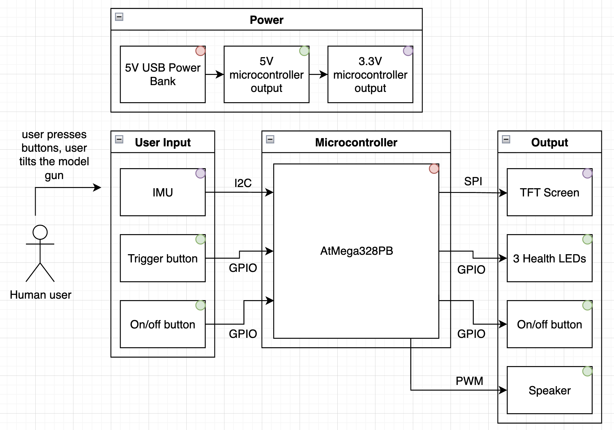
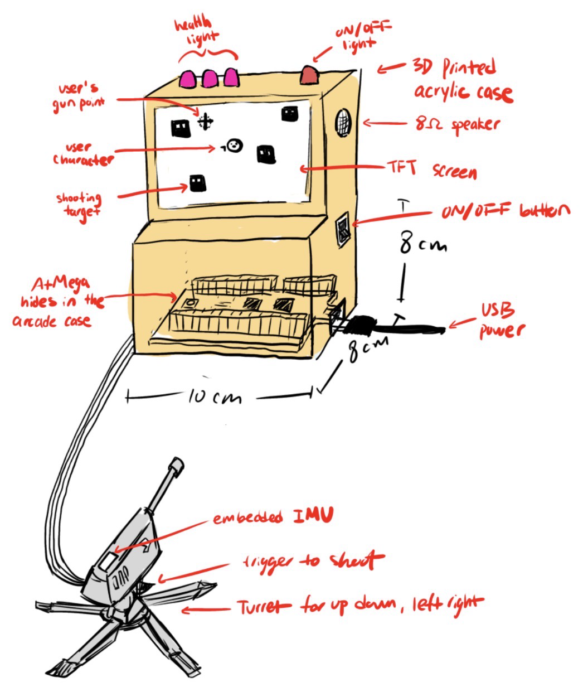

# Final Project

**Team Number:** T14

**Team Name:** doomsDAY

| Team Member Name | Email Address           |
| ---------------- | ----------------------- |
| Amaris Chen      | amarisch@seas.upenn.edu |
| Daniel Lin       | danilin@seas.upenn.edu  |
| Yi Lu Zheng      | yzheng6@seas.upenn.edu  |

**GitHub Repository URL:** [https://github.com/upenn-embedded/final-project-s26-t14.git](https://github.com/upenn-embedded/final-project-s26-t14.git)

**GitHub Pages Website URL:** [https://upenn-embedded.github.io/final-project-s26-t14/](https://upenn-embedded.github.io/final-project-s26-t14/)

## Final Project Proposal

### 1. Abstract

The Mini Arcade Station features a simplified smash-TV shooting game with an external model turret gun in place of joy sticks. It has a TFT screen to display menu and game, signal lights, a buzzer/speaker to generate sound output, and an IMU sensor to determine turret angle.

### 2. Motivation

For retro arcade lovers and parents on a tight budget, the Mini Arcade Station is perfect to have while occupying a small space. This project not only allows gamer folks to play an arcade-style game within the homes, but it also takes a child's attention away from the phone and onto a physical game that is tactile and interactive. The shooting game itself is inspired from Stardew Valley's Journey of the Prairie King, a minigame which Amaris enjoys.

### 3. System Block Diagram

### 4. Design Sketches

### 5. Software Requirements Specification (SRS)

**5.1 Definitions, Abbreviations**

GPIO: General Purpose Input Output

LED: Light Emitting Diode

I2C: Inter-Integrated Circuit

SPI: Serial Peripheral Interface

TFT LCD: Thin-Film Transistor Liquid Crystal Display

**5.2 Functionality**

| ID     | Description                                                                                                                                     |
| ------ | ----------------------------------------------------------------------------------------------------------------------------------------------- |
| SRS-01 | The IMU 3-axis acceleration will be used to measure the position of the gun and where the cursor should be on screen relative to gun position. |
| SRS-02 | Use interrupts to handle button presses and game states (such as reloading, shooting, killing enemies, etc.)                                    |
| SRS-03 | I2C communication will be used to communication data between the gun and the main arcade machine.                                               |
| SRS-04 | The health of the player should be displayed through the LED indicators at the top of the arcade machine.                                       |
| SRS-05 | The buzzer should play sounds when an action is performed (ie. shooting).                                                                       |
| SRS-06 | The score of the player should be displayed.                                                                                                    |

### 6. Hardware Requirements Specification (HRS)

**6.1 Definitions, Abbreviations**

GPIO: General Purpose Input Output

LED: Light Emitting Diode

I2C: Inter-Integrated Circuit

SPI: Serial Peripheral Interface

TFT LCD: Thin-Film Transistor Liquid Crystal Display

**6.2 Functionality**

| ID     | Description                                                                                                                               |
| ------ | ----------------------------------------------------------------------------------------------------------------------------------------- |
| HRS-01 | ATmega328PB is the main microcontroller for this design.                                                                                  |
| HRS-02 | The TFT display will be a 3.5" SPI-interfaced color LCD with a minimum resolution of 320x480 pixels and support for 16-bit color depth.   |
| HRS-03 | The MPU-6050 IMU shall be powered at 3.3V and communicate with the gun ATmega328PB over I2C.                                              |
| HRS-04 | The trigger button shall be connected to external interrupt pin with internal pull-up resistor, producing falling edge signal detections. |
| HRS-05 | The speaker shall produce audible output at frequencies for sound effects, and game start & end indicator.                                |
| HRS-06 | Each LED shall illuminate when driven by GPIO pins through current limiting resistors.                                                    |
| HRS-07 | A on/off switch will be used to turn the arcade machine on/off.                                                                            |

### 7. Bill of Materials (BOM)

### 8. Final Demo Goals

### 9. Sprint Planning

| Milestone  | Functionality Achieved | Distribution of Work |
| ---------- | ---------------------- | -------------------- |
| Sprint #1  |                        |                      |
| Sprint #2  |                        |                      |
| MVP Demo   |                        |                      |
| Final Demo |                        |                      |

**This is the end of the Project Proposal section. The remaining sections will be filled out based on the milestone schedule.**

## Sprint Review #1

### Last week's progress

### Current state of project

### Next week's plan

## Sprint Review #2

### Last week's progress

### Current state of project

### Next week's plan

## MVP Demo

## Final Report

Don't forget to make the GitHub pages public website!
If you’ve never made a GitHub pages website before, you can follow this webpage (though, substitute your final project repository for the GitHub username one in the quickstart guide):  [https://docs.github.com/en/pages/quickstart](https://docs.github.com/en/pages/quickstart)

### 1. Video

### 2. Images

### 3. Results

#### 3.1 Software Requirements Specification (SRS) Results

| ID     | Description                                                                                               | Validation Outcome                                                                          |
| ------ | --------------------------------------------------------------------------------------------------------- | ------------------------------------------------------------------------------------------- |
| SRS-01 | The IMU 3-axis acceleration will be measured with 16-bit depth every 100 milliseconds +/-10 milliseconds. | Confirmed, logged output from the MCU is saved to "validation" folder in GitHub repository. |

#### 3.2 Hardware Requirements Specification (HRS) Results

| ID     | Description                                                                                                                        | Validation Outcome                                                                                                      |
| ------ | ---------------------------------------------------------------------------------------------------------------------------------- | ----------------------------------------------------------------------------------------------------------------------- |
| HRS-01 | A distance sensor shall be used for obstacle detection. The sensor shall detect obstacles at a maximum distance of at least 10 cm. | Confirmed, sensed obstacles up to 15cm. Video in "validation" folder, shows tape measure and logged output to terminal. |
|        |                                                                                                                                    |                                                                                                                         |

### 4. Conclusion

## References
