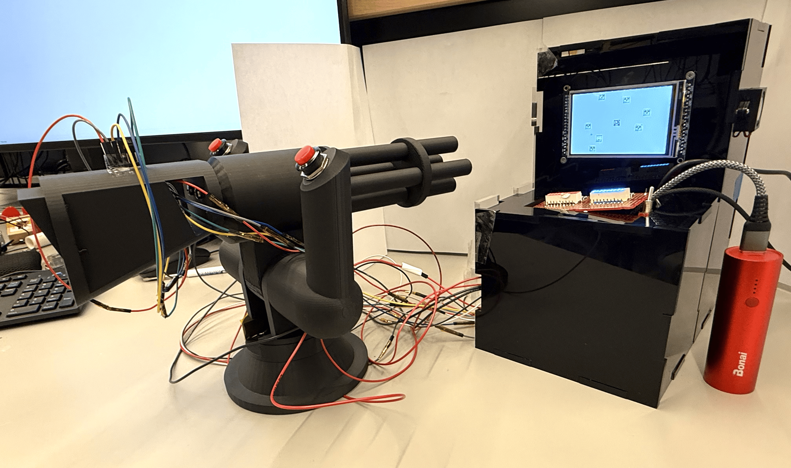
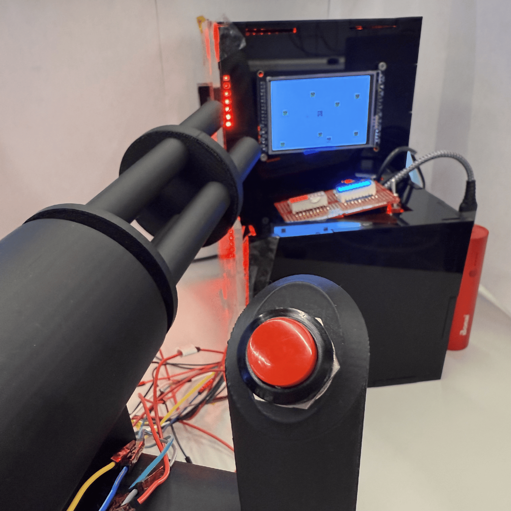
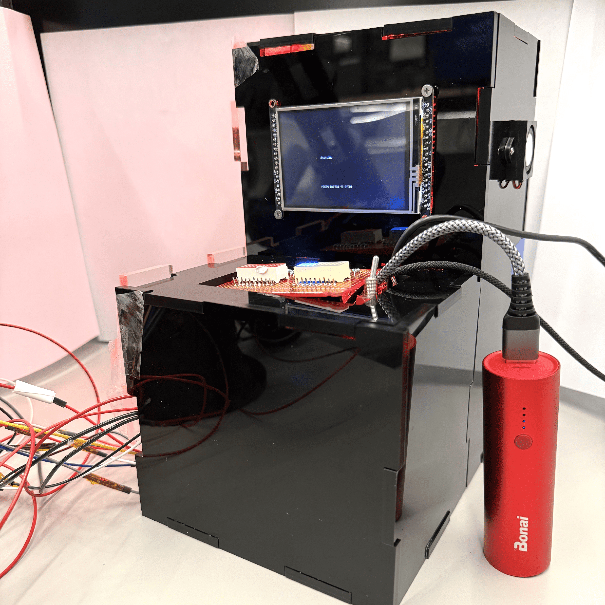

### 0. Abstract

The Mini Arcade Station features a simplified smash-TV shooting game with an external model turret gun in place of joy sticks. It has a TFT screen to display menu and game, signal lights, a buzzer/speaker to generate sound output, and an IMU sensor to determine turret angle.

### 1. Video

### 2. Images

|    |  |
| ---------------------------------- | ---------------------------------- |
|  |            |

### 3. Results

#### 3.1 Software Requirements Specification (SRS) Results

#### 3.2 Hardware Requirements Specification (HRS) Results

### 4. Conclusion

### 5. References
