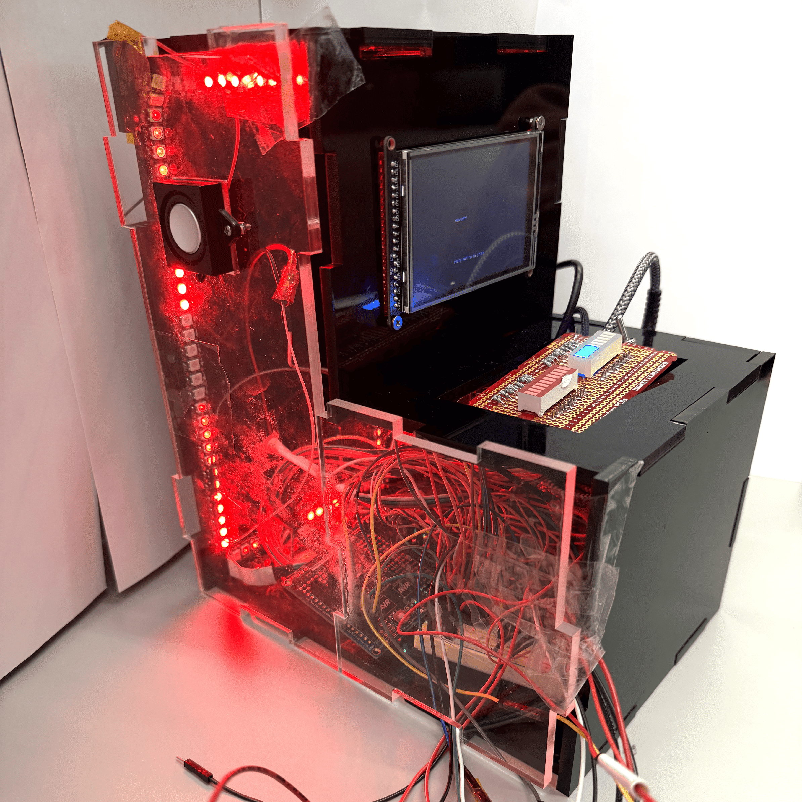
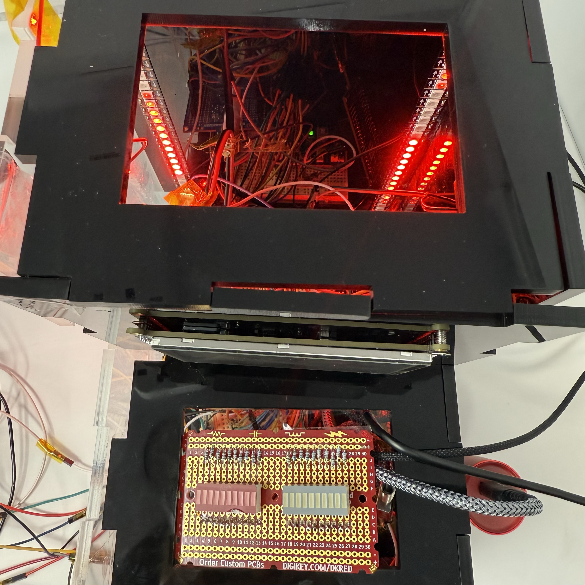
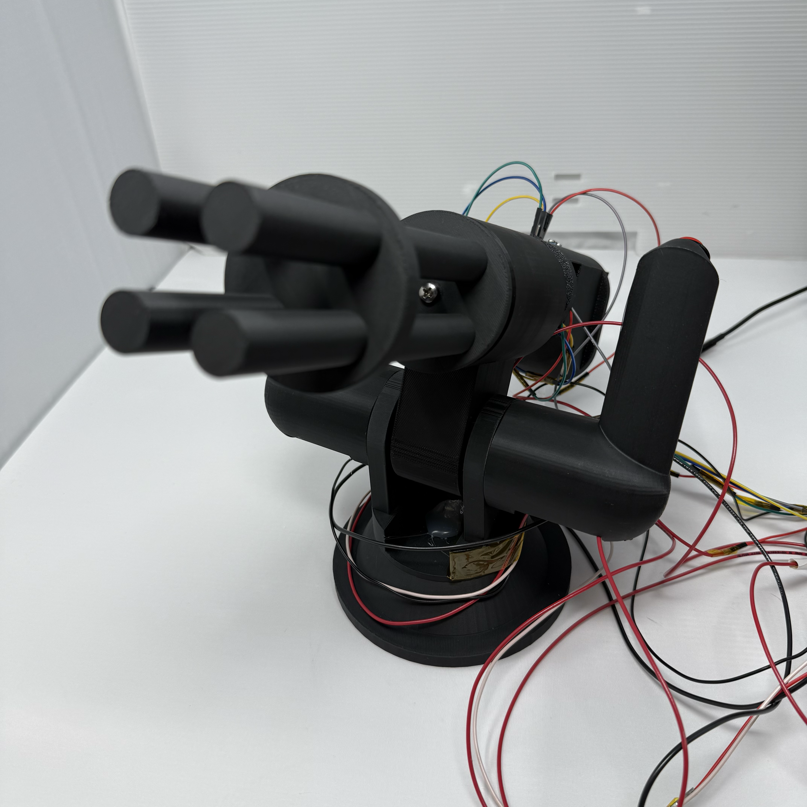
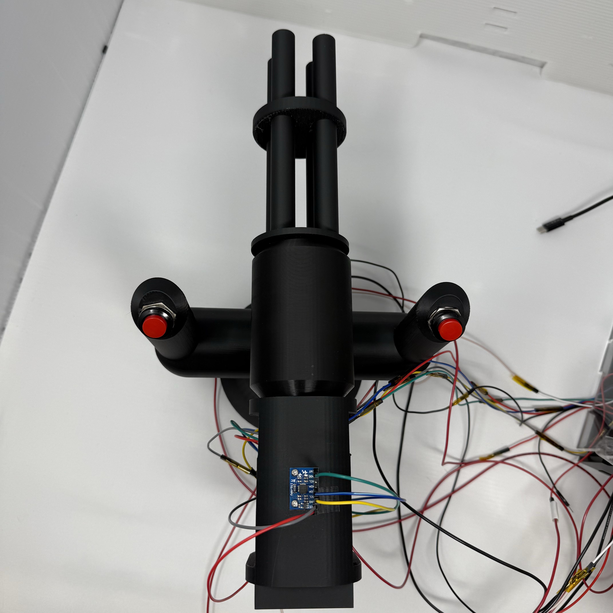
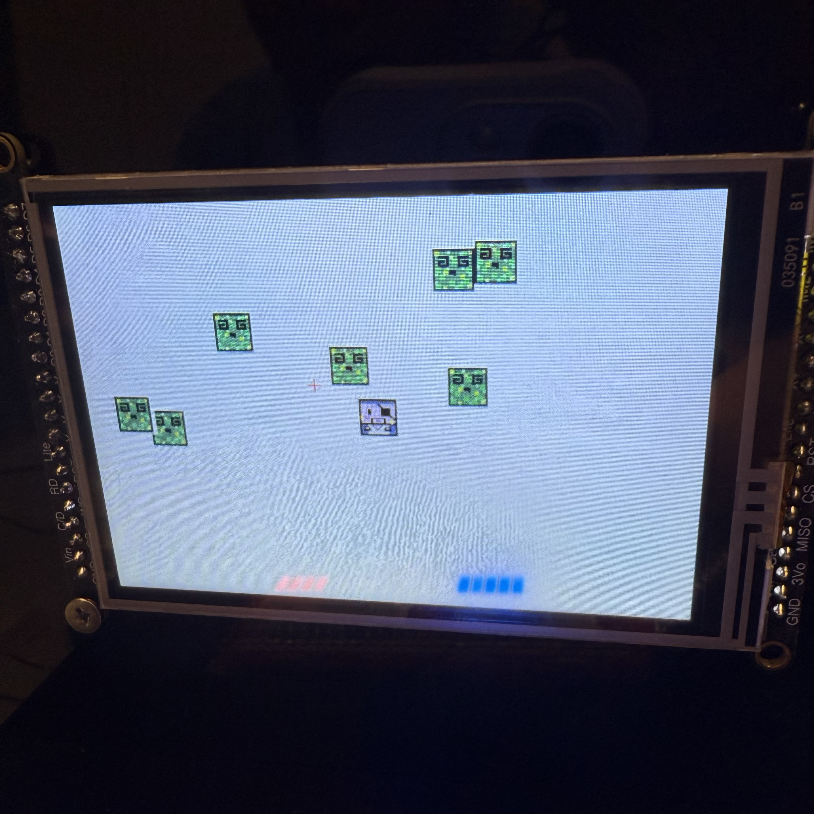

### 0. Abstract

The Mini Arcade Station features a simplified smash-TV shooting game with an external model turret gun in place of joy sticks. It is an embedded game on AtMega328PB.

### 1. Video

### 2. Images

  

  
  
  

  
  
  

### 3. Results

Our final design comes in two parts:

1. A laser-cut acrylic arcade box containing 2 AtMega328PB's, 2 LED segment displays, 1 GPIO extender, 1 LCD screen, 2 speakers, and connecting wires used to output game state. A LED strip is along the back board of the box for back lighting, featuring its own power bank, power module, and on/off switch
2. A 3D-printed turret gun with 2 push buttons, 1 IMU chip, and 2 rotary potentiometers as user input

#### 3.1 Software Requirements Specification (SRS) Results

| ID     | Description                                                                                                                                                                                                                                                                                                           | Validation Outcome                                             |
| ------ | --------------------------------------------------------------------------------------------------------------------------------------------------------------------------------------------------------------------------------------------------------------------------------------------------------------------- | -------------------------------------------------------------- |
| SRS-01 | The IMU built-in interrupt pin shall be used to detect shock on the turret.                                                                                                                                                                                                                                          | Confirmed, UART logs in validation folder in GitHub repo       |
| SRS-02 | Use interrupts to handle button presses and game states (such as reloading, shooting, killing enemies, etc.)                                                                                                                                                                                                          | Confirmed, game shown in video                                 |
| SRS-03 | Potentiometer values shall be read via ADC and tunned according to the screen size                                                                                                                                                                                                                                    | Confirmed, UART logs in validation folder in GitHub repo       |
| SRS-04 | I2C communication shall be used for the GPIO pin extender to control LED segments and display health and ammo                                                                                                                                                                                                         | Confirmed, segments turn on and off based on user interactions |
| SRS-05 | The buzzer should play sounds when shoot action is performed                                                                                                                                                                                                                                                          | Confirmed, sound can be heard in our video                     |
| SRS-06 | The TFT screen shall communicate via SPI to show menu and game screens. Everyime an enemy is shot, there is a 10% chance of the screen being covered by green slime, and the player needs to shake the turret to clear the screen. When all enemies are shot, the player advances to next stage with faster enemies. | Confirmed, game shown in video                                 |

#### 3.2 Hardware Requirements Specification (HRS) Results

All hardware requirements specifications can be observed from images under the Image section or the video under the Video section.

| ID     | Description                                                                                         | Validation Outcome                                                          |
| ------ | --------------------------------------------------------------------------------------------------- | --------------------------------------------------------------------------- |
| HRS-01 | ATmega328PB shall be the main microcontroller for this design                                       | Confirmed, seen through clear side panel of casing                          |
| HRS-02 | Potentiometers shall be connected to the vertical and horizontal axles of the turret                | Confirmed, mounted inside the turret; functionality is affirmed by SRS      |
| HRS-03 | The MPU-6050 IMU shall be powered at 5V                                                             | Confirmed, mounted on the top end of the turret, connected via jumper wires |
| HRS-04 | Trigger buttons shall be connected to external interrupt pin                                        | Confirmed, two mounted at the top of each handle of the turret              |
| HRS-05 | The speaker shall produce audible output whenever the trigger button is pressed                     | Confirmed, sound can be heard in our video                                  |
| HRS-06 | LED segment displays shall illuminate when driven by GPIO pins through current limiting resistors   | Confirmed, displays and resistors are soldered on a perf board              |
| HRS-07 | A on/off switch shall be used to turn LED strip on and off                                          | Confirmed, attached right next to the perf board                            |
| HRS-08 | LED strip shall illuminate the inside casing for aesthetics                                         | Confirmed, red lighting is seen from the clear side panel of casing        |
| HRS-09 | The TFT display will be a 3.5" SPI-interfaced color LCD with a minimum resolution of 320x480 pixels | Confirmed, mounted on the upper front panel of casing                       |

### 4. Conclusion

We learned how to integrate across different timelines and people. For example, when Yi Lu first wrote the sound code, she didn't have the IMU or the game yet. When the sound code was passed to Amaris, Amaris had to package Yi Lu's code in sound.c library and ensured that it didn't use any pins/timers occupied by IMU polling. Finally, when Amaris passed that to Daniel, Daniel had to use a second AtMega for sound generation, in addition to changing the IMU polling to interrupts.

We are proud to see this project through its many stages. Our final design was more than what we originally proposed as we added/repurposed sensors, and due to these hardware changes our game had to be more complicated. The fun of this project really came from sparking new ideas with one another and executing it as a team. Some next steps to this project could be: adding mini vibrational motor discs in the turret handles, having concurrent music during game play, and including more player/enemy spirites.

### 5. References
